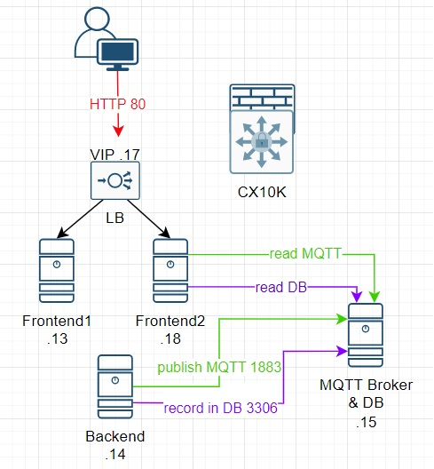

# EW trafic simulator on single VM
Tested using ubuntu server 24.04

# network consideration
vm need to be connected on 2 networks
- 802.1q link to enable macvlan between docker
- oob management lan to get access to the web frontend (nginx) from external

# Create VLAN interface on the VM (VM need to be connected through 802.1Q link to the CX10K)
sudo ip link add link ens224 name ens224.21 type vlan id 21
sudo ip link set up ens224
sudo ip link set up ens224.21

# Clone the github repository
git clone https://github.com/malokaff/EW-demo-docker

# Install the right package on the VM
sudo apt-get install docker.io
sudo apt-get install docker-compose-v2

# Change config file according to the ip setup 
nano EW-demo-docker/config/config.py
nano EW-demo-docker/config/config.php
nano EW-demo-docker/config/dns/db.pod1
cp EW-demo-docker/config/config.php data/frontend1/EW-demo-frontend/config.php
cp EW-demo-docker/config/config.php data/frontend2/EW-demo-frontend/config.php

# Run docker compose
cd EW-demo-docker/
sudo docker compose -f docker-compose-macvlan.yml up --build

# Join bridge network to access to frontend out of band on port 80 (also needed for frontend 1 and frontend 2 to access PSM admin)
sudo docker network connect bridge nginx-lb
sudo docker network connect bridge frontend1
sudo docker network connect bridge frontend2

