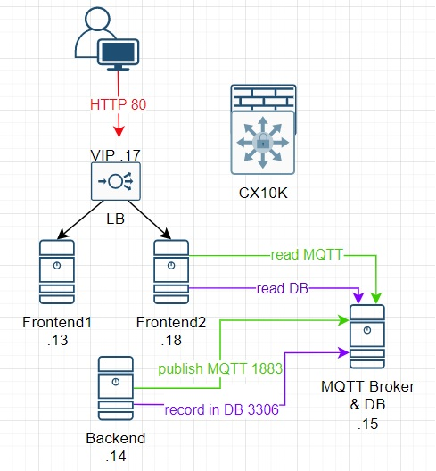

# Introduction
Small app to simulate east-west trafic 
Tested on Ubuntu Server 24.04

This app require a single VM and use docker isolation (macvlan) to force trafic going through the network
Backend is running 2 python script to send SQL and MQTT data to mysql/mosquitto VM
Frontend is displaying data on a webpage

Please find below a diagram that shown the app (with 2 frontend in this case but not mandatory of course)

# Create VLAN interface on Linux server
- sudo ip link add link ens224 name ens224.21 type vlan id 21
- sudo ip link set up ens224
- sudo ip link set up ens224.21

# Clone the github repository
- git clone https://github.com/malokaff/EW-demo-docker

# Install the right package on the VM
- sudo apt-get install docker.io
- sudo apt-get install docker-compose-v2

# Edit config file and run the preparation script
- nano EW-demo-docker/config/ip.cfg
- sudo docker compose -f EW-demo-docker/docker-compose-prep.yml up --build

# Run docker compose
- cd EW-demo-docker/
- sudo docker compose -f docker-compose-auto.yml up --build

# Join bridge network to access to frontend out of band on port 80
also needed for frontend 1 and frontend 2 to access PSM admin
- sudo docker network connect bridge nginx-lb
- sudo docker network connect bridge frontend1
- sudo docker network connect bridge frontend2

# optional : add portainer and psm-updater (need to be started before docker-compose-auto above)
It’s possible to automate the creation of ip collection when a docker is created using psm-updater (created by Francois Prowse)
Psm-updater is triggered by portainer when docker is created and removed 
More information of psm-updater here:
https://hub.docker.com/r/farsonic/docker-psm-event-updater 
#### start portainer
- sudo docker volume create portainer_data
- sudo docker run -d -p 8000:8000 -p 9443:9443 --name portainer --restart=always -v /var/run/docker.sock:/var/run/docker.sock -v portainer_data:/data portainer/portainer-ce:2.21.4
- sudo docker run -d   -p 9001:9001   --name portainer_agent   --restart=always   -v /var/run/docker.sock:/var/run/docker.sock   -v - /var/lib/docker/volumes:/var/lib/docker/volumes   -v /:/host   portainer/agent:2.21.4
#### start psm-updater
sudo docker compose -f docker-compose-psm-updater.yml up --build
