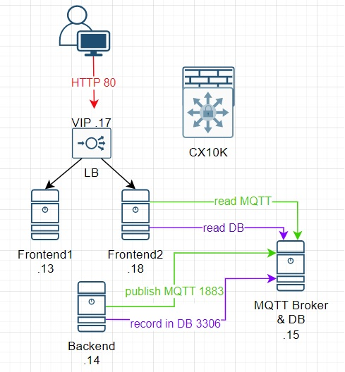

# introduction
Small app to simulate east-west trafic in 2 part to demo AMD Pensando technologies
frontend part (this repository) and backend part below
https://github.com/malokaff/EW-demo-backend

This app require 3x VM :
- 1x VM for frontend 
- 1x VM for backend
- 1x VM for mysql server and mosquitto
Backend is running 2 python script to send SQL and MQTT data to mysql/mosquitto VM
Frontend is displaying data on a webpage

Please find below a diagram that shown the app (with 2 frontend in this case but not mandatory of course)

# EW-demo-frontend
on the frontend you will need:
-	apache
-	php
-	python with the following modules:
o	pip install paho-mqtt
o	pip install paho-mqtt
o	pip install mysql-connector-python

on mqtt/mysql server, you will need
-	Mysql
-	Apache / php (to use phpMyAdmin)
-	PhpMyAdmin
-	Mosquito (MQTT broker)

The backend server is the simpler one as your just need to install python and the following python module:
-	pip install paho-mqtt

